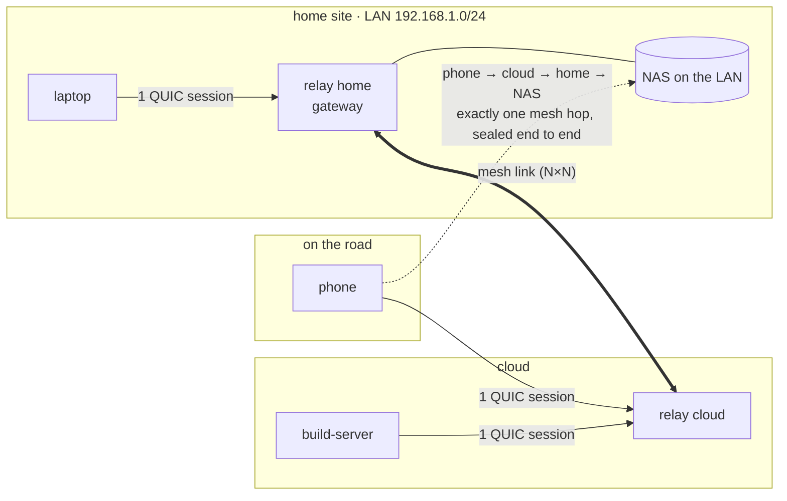
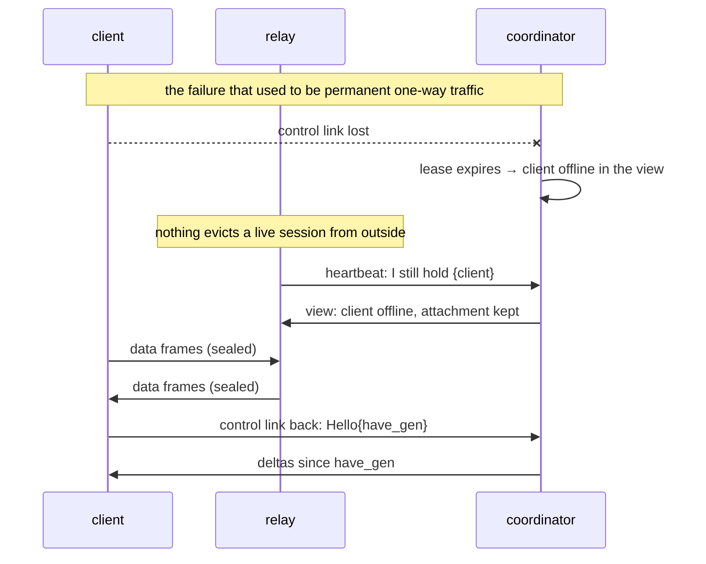

# NetQ VPN (`nqvpn`)

**A relay-mesh overlay network that stays correct when the network does not.**

NetQ is an L3 (TUN), dual-stack VPN built as a small fleet of interconnected
relays and one control-plane coordinator. Clients hold exactly one QUIC
session to a relay of their choice; relays hold a full mesh between each
other; every packet is sealed end to end with Noise IK so relays forward what
they cannot read. The coordinator never touches traffic — and the data plane
keeps running when the coordinator, or the path to it, is gone.

```
                    ┌─────────────────────────┐
                    │      nqvpn-coord        │   control only:
                    │  join · view · admin UI │   HTTPS + QUIC
                    └───────┬─────────┬───────┘
          generation-numbered│         │heartbeats
                    ┌────────▼──┐   ┌──▼────────┐
   laptop ─────────►│  relay    │═══│  relay    │◄───────── phone
   (TUN)            │  home     │   │  cloud    │           (TUN)
   office-pc ──────►│  gateway  │═══│           │◄───────── build-server
                    └───┬───────┘   └───────────┘
                  192.168.1.0/24            full mesh, N×N
                  (site LAN)                (pure forwarders, no TUN)
```

## Why a relay mesh

| | Hub and spoke | Full P2P mesh | **NetQ relay mesh** |
|---|---|---|---|
| Sessions per client | 1 | N−1, NAT traversal, holes | **1** |
| Hops between two clients | 2 (always via the hub) | 1 | 1 or 2, by table lookup |
| Who learns your IP | the hub | every peer | **only your relay** |
| Site-to-site (LAN behind a node) | hub is the gateway | every node routes | **any relay is a gateway; two of them fail over by age** |
| What breaks when the control plane is down | nothing… until keys expire | discovery, NAT punching | **nothing for 15 min; sessions live until credentials expire** |
| Forwarding logic | trivial | complex | **one page** (§6 of DESIGN.md) |



## Design principles

The whole design fits in one sentence: **every piece of shared state is a
pure function of what the coordinator published plus what the node itself
holds** — nothing is set by one message and cleared by another. Concretely:

1. **Push for speed, generation for continuity, heartbeat for safety.** The
   coordinator publishes one *view* per network under a 64-bit generation.
   Changes are pushed as deltas the moment they happen; a delta applies only
   onto exactly the generation a member holds, otherwise it asks for a
   snapshot; every heartbeat carries the held generation and a digest of it,
   so a member that missed a push is caught up within one heartbeat and one
   that *disagrees* at the same generation is logged as the bug it is.
2. **Nodes send facts, not events.** A relay's heartbeat is the whole set of
   clients it holds. There is no attach/detach message to lose or reorder;
   the attachment table is derived — most recent declaration wins — and an
   entry disappears only when no relay declares it.
3. **One task owns one connection.** On every hop, from both ends, a session
   is a single task that authenticates, answers probes, refreshes its
   credential, and ends at expiry or probe timeout. The only way a session
   leaves a table is that task ending. The coordinator never touches one.
4. **Reconcile by diff against observed state.** Desired state arrives
   whole; a node diffs it against what it actually has (open sessions, dialer
   handles, kernel routes) and acts only on the difference, idempotently, on
   every change and on a timer.
5. **Control-plane trouble never becomes data-plane trouble.** A client or
   relay that cannot reach the coordinator keeps forwarding; a coordinator
   restart interrupts nothing; a lost push costs one heartbeat.
6. **Loops are impossible twice.** By construction (a frame crosses at most
   one mesh link) and by a hop counter in every frame that no table can
   override.
7. **A member is a name and a secret.** Nothing else authenticates: no
   certificate pinning, no device lock, no key rotation ceremony. Joining
   from a new machine replaces the old one immediately. Node ids are 32-bit
   wire identities assigned by the coordinator and never configured.
8. **Every drop has a name, every path can be traced.** Six bytes in the
   frame header (`hop`, `trace`) let a relay report exactly what it did
   with a packet back to the sender — `traceroute` for the overlay.



## What a member does when things go wrong

Three rules, each with a chaos test behind it:

1. **A valid member connects eventually.** As long as the coordinator is
   reachable, a member with a valid name and secret gets in: join and
   control-link retries are tight (1, 2, 4, 5, 5 … seconds, never longer),
   and a lost session is simply re-established — the view is kept, and the
   coordinator sends only what changed.
2. **A kicked-out member stops.** If the coordinator turns a member away for
   good — **replaced** by a newer join under the same name, **disabled**,
   deleted, or a secret that no longer matches — the process learns the
   reason, stops retrying and exits: `3` when replaced, `4` when refused.
   It does *not* re-join: a re-join would win (last join wins, by design)
   and the two instances would take turns replacing each other forever. A
   replacement that was not your doing means the secret leaked — the
   coordinator records where the replacing join came from — so rotate it.
   Relays tell stale instances the same on the data plane, so a client
   whose coordinator link is down still finds out from its relay.
   Supervisors should not restart these exit codes blindly
   (`RestartPreventExitStatus=3 4`; see `configs/systemd/`).
3. **A preferred relay is a preference.** A client may name a relay; it
   attaches there whenever the relay is reachable, falls back to the
   lowest-RTT relay when it is not (or does not exist), and moves back on
   its own once the preferred relay answers again. Nothing ever waits for
   a relay that is not there.

And one guarantee for the clients of a relay that was replaced from another
machine: the coordinator publishes the relay's new address and session
certificate; every client attached to the old process sees its fleet entry
change under it, drops the zombie even though it still answers, and
re-attaches to the fleet as published.

## What's in the box

| Crate | Owns |
|---|---|
| `nqvpn-proto` | wire format, Noise IK sealing (two-phase replay window), credentials, the shared `Snapshot`/`Delta`/digest logic, the HTTPS join client |
| `nqvpn-session` | "one task owns one connection": Hello, Refresh, probes, expiry |
| `nqvpn-sync` | member side of the generation protocol + the reconciler driver |
| `nqvpn-endpoint` | Noise engine, ingress filter, TUN, routes as a function of the view with local-LAN/underlay exclusion |
| `nqvpn-relay` | one `RelayNet` per network (multi-tenant), the one-page forwarding rule, mesh dialers, hop guard, trace notes |
| `nqvpn-client` | ~500 lines of wiring |
| `nqvpn-coord` | networks and members in SQLite, join by token, leases, directory with generations and a delta ring, HTTPS API, embedded live admin UI |

Dependencies point strictly downward (`proto ← session ← sync/endpoint ←
relay/client`; `coord ← proto`), so each crate is reviewable on its own.
[`DESIGN.md`](DESIGN.md) is the full specification.

## Quick start

Nothing is configured on members. The coordinator holds every network and
member in its database; a machine gets one **token** and discovers
everything else — network, name, role, address, routed prefixes, relay
fleet, MTU — when it joins.

**1. Coordinator** — `configs/coordinator.toml` is the only file:

```toml
[listen]
api  = "0.0.0.0:8443"        # HTTPS: the UI at /ui, the API at /api/v1/*
quic = "0.0.0.0:14433"       # control plane; published to members at join
# public_url = "https://coord.example.com:8443"   # written into every token
[state]
dir = "/var/lib/nqvpn-coord" # nqvpn.db, signing key, self-signed certificate
[admin]
user = "admin"
password_hash = "$argon2id$…" # nqvpn-coord hash-password
```

```sh
nqvpn-coord hash-password             # paste the output into [admin] password_hash
nqvpn-coord run --config configs/coordinator.toml
```

**2. Open the UI** at `https://coord:8443/ui`, sign in, and follow the
wizard: *New network* (id, address space, defaults are fine) → *Add
member*. A relay gets an address to advertise (`auto:4444` means "wherever
it joins from"), optionally an overlay address and the LANs it routes; a
client optionally a preferred relay and a fixed address. Every member gets
a token and a ready-to-paste config.

**3. Members** hold the token and local facts only:

```toml
# /etc/nqvpn/relay.toml
listen = "0.0.0.0:4444"      # the port in the relay's address at the coordinator
[[networks]]
token = "nqv1.…"             # one entry per network this relay serves
```

```sh
nqvpn-client --token "nqv1.…"          # or token_file = "…" in /etc/nqvpn/client.toml
```

Change anything about a member in the UI — its address, the LAN it routes,
its preferred relay — and it is told to re-join; it applies the change in
place, without a restart. Regenerate a token and the old one stops
working immediately; whoever holds it is thrown off and stops.

The UI is a single embedded page (no external assets), responsive, and
pushed over a WebSocket: topology, traffic matrix, member state and prefix
ownership update as they happen. `Export` / `Import` move all
configuration as JSON for backup or version control.

## Testing philosophy

Correctness here means *convergence under failure*, so the test suite is
built around breaking things:

- **Unit**: every decision is a pure function with its own tests — the
  forwarding rule, `Snapshot::diff/apply/digest`, lease resolution, route
  exclusion, the replay window, crossed handshakes.
- **Crate level**: one connection's lifecycle (expiry, probe timeout,
  Refresh continuity); the generation protocol against a real coordinator
  (catch-up by deltas, snapshot on a gap, digest mismatch, restart grace);
  forwarding across real QUIC with a stubbed coordinator (spoofing, loops,
  eviction on the wire, trace notes).
- **Chaos** (`crates/nqvpn-client/tests/chaos.rs`): a real coordinator,
  real relays and many fake-TUN clients in one process — relay crashes,
  relay flapping, mesh links cut, clients and relays losing their
  coordinator link, coordinator restarts (and a coordinator that comes up
  late), a client or relay replaced from another machine (told by the
  coordinator, or by a relay when the coordinator link is down), disable,
  token regeneration, preferred-relay fallback and return, a byzantine
  relay that duplicates, corrupts and drops frames, a member reconfigured
  live from the coordinator (new address, a LAN added and withdrawn), a
  relay with an `auto:` address, and a coordinator reloading everything
  from its database — each asserting that traffic converges without anyone
  restarting anything by hand, and that a kicked-out instance stops
  instead of fighting back.

```sh
cargo test                      # everything, ~2 minutes
cargo test -p nqvpn-client --test chaos -- --nocapture   # watch the chaos
```

## Status

Linux and macOS clients and relays; Windows, DNS and full-tunnel exit nodes
are not implemented. Apache-2.0.
